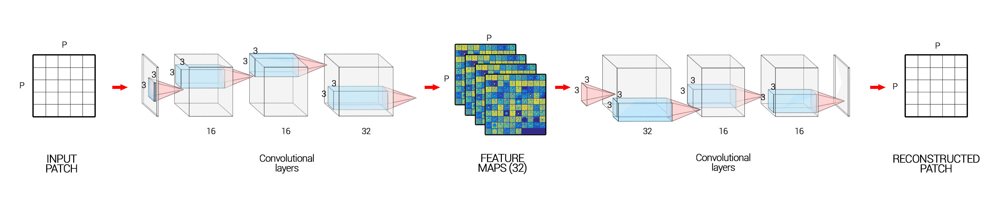

# Unsupervised-Change-Detection
Unsupervised Change Detection using Deep Learning Techniques for Age-Related Macular Degeneration Progression

This repo shows a novel approach to unsupervised change detection.
We used it on retinal images of AMD patients.
It would thus make it possible to describe its evolution in order to build a predictive model.

The folder codes contains all the functions we use for processing the images, building the loaders ect.

The folder models contains the autoencoder in Pytorch.

Our algorithm is in two parts : pretraining.py and finetuning.py . Don't forget to change the paths for your images.

To launch all the algorithm just run pipeline.py.

Here is the architecture of our neural networks :

Our algorithm  :

