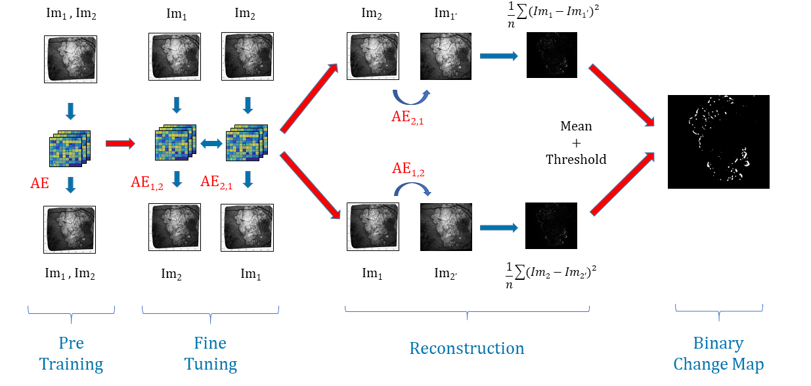

# Unsupervised-Change-Detection
Unsupervised Change Detection using Deep Learning Techniques for Age-Related Macular Degeneration Progression

This repo shows a novel approach to unsupervised change detection.
We used it on retinal images of AMD patients.
It would thus make it possible to describe its evolution in order to build a predictive model.

